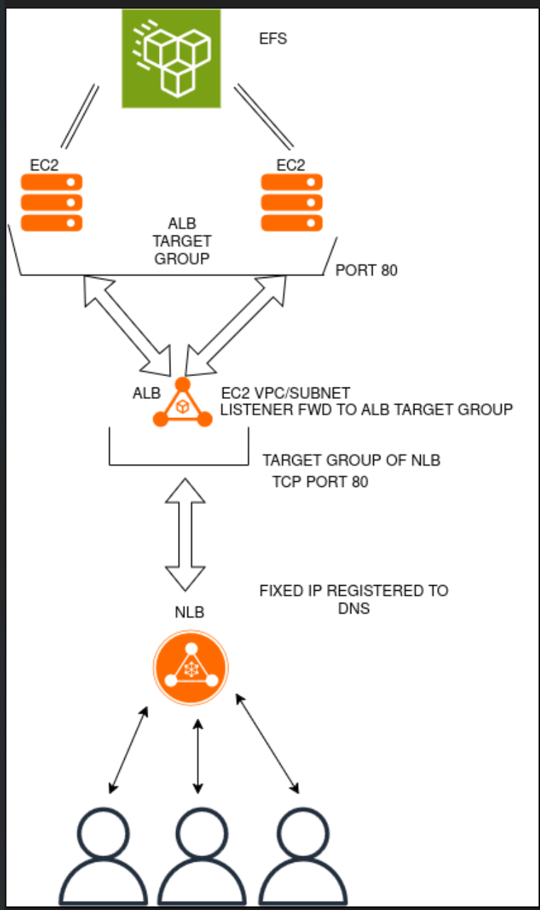

# NLB-ALB-EC2-EFS-AWS_CHAIN
README

This is a README for a simple AWS project demonstrating a Network Load Balancer placed
in front of an Application Load Balancer which fronts for two httpd EC2 instances attached to an EFS system.



I started by creating a AMI image to use as the httpd template as outlined below:  
```bash
yum update -y && yum install -y httpd
systemctl start httpd
systemctl enable httpd
echo "Hello World from $(hostname -f)" > /var/www/html/index.html
```


This script creates a simple landing page with a hello world message. This is intended as a stand-in for whatever reasource the theoretical org in this lab would actually be using (ex. a database requiring specific IP whitelisting which the Network Load Balancer is able to provide).

I created an Elastic File System for use with the instances, and attached it during their creation using "Launch from AMI". This file system ensures that regardless of Load Balancer distribution, data held on the backend can be synchronized across users and sessions. For this example I did not enable sticky sessions with cookie tracking, although that would be an option depending on use case. (IMAGE EFS_FILE_POLICY , IMAGE EFS_ATTACHED_TO_EC2)

Both EC2 instances were registered as a target group receiving on port 80. (IMAGE ALB_TARGET_GROUP)

(Side note: while 443 with an additional TLS listener is the correct production choice for the external facing NLB and unencrypted port 80 internal listeners the correct production use, I used port 80 throughout for demonstration simplicity)

I then created an Application Load Balancer and registered the EC2 target group to it, putting the ALB listener on port 80, set to fwd traffic to its target group.

I registered a target group for the NLB specifically targeting the Application Load Balancer (TCP on port 80) (IMAGE ALB_SET_AS_NLB_TARGET)

I then created the Network Load Balancer with a Listener on Port 80 fwd traffic to the Application Load Balancer. The Network Load Balancer was placed in the same VPC and subnets as the Application Load Balancer.

Once the Network Load Balancer was provisioned and registered with DNS, a hello world message could be accessed through the Network Load Balancer DNS address. (IMAGE FINAL_PRODUCT_NLBDNS)

Ultimately, this setup demonstrates an architecture commonly used when a static IP is required for whitelisting (provided by the NLB), while still leveraging the Layer 7 routing capabilities (query sting / fixed response / redirect etc) of the ALB for the backend.
